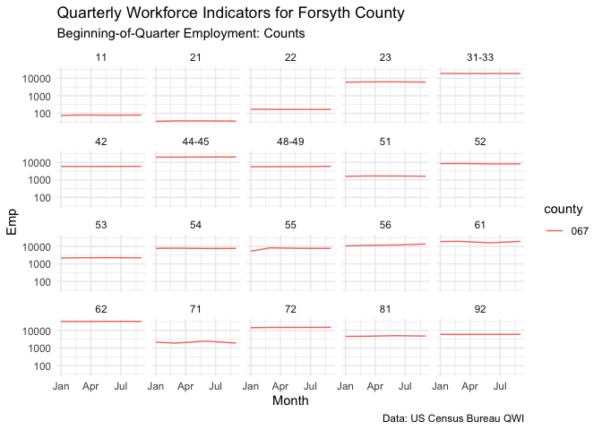

<!-- README.md is generated from README.Rmd. Please edit that file -->

<!-- badges here -->

[](https://cran.r-project.org/package=tidyqwi)
[](https://travis-ci.org/medewitt/tidyqwi)
[](https://ci.appveyor.com/project/medewitt/tidyqwi)[](https://codecov.io/github/medewitt/tidyqwi?branch=master)
[](https://www.tidyverse.org/lifecycle/#experimental)
[](https://cran.r-project.org/package=tidyqwi)[](https://doi.org/10.21105/joss.01462)

<!-- end badges -->

# tidyqwi

The goal of `tidyqwi` is to make accessing the US Census Bureau’s
*Quarterly Workforce Indicators* easier in a tidy format. This package
allows a user to specify the years and states of interest as well as
some of the additional parameters (desired cross tabs, MSA vs county
level data, firm size, etc) and submit them to the US Census API. This
package then stays within the US Census guidelines for API submission
for this data and returns a combined tidy dataframe for future analysis.

This is a work in progress\!

## Installation

Install via CRAN with:

``` r
install.packages("tidyqwi")
```

Or the development version at:

``` r
remotes::install_github("medewitt/tidyqwi")
```

## Use

After installation you can load and retrieve the desired data\!

``` r
library(tidyqwi)

nc_qwi <- get_qwi(years = "2010", 
                  states = "11", 
                  geography = "county", 
                  apikey =  census_key, 
                  endpoint = "rh",
                  variables = c("sEmp", "Emp"), all_groups = FALSE,
                  industry_level = "2", processing = "multiprocess")
```

And look at your data:

``` r
head(nc_qwi)
#> # A tibble: 6 x 12
#>   year  quarter agegrp sex   ownercode seasonadj industry state county
#>   <chr> <chr>   <chr>  <chr> <chr>     <chr>     <chr>    <chr> <chr> 
#> 1 2010  1       A00    0     A00       U         11       37    001   
#> 2 2010  1       A00    0     A00       U         11       37    003   
#> 3 2010  1       A00    0     A00       U         11       37    005   
#> 4 2010  1       A00    0     A00       U         11       37    007   
#> 5 2010  1       A00    0     A00       U         11       37    009   
#> 6 2010  1       A00    0     A00       U         11       37    011   
#> # … with 3 more variables: Emp <chr>, sEmp <chr>, year_time <date>
```

And there are labels added if desired

``` r
labelled_nc <- add_qwi_labels(nc_qwi)
```

``` r
Hmisc::describe(labelled_nc$Emp)
#> labelled_nc$Emp : Beginning-of-Quarter Employment: Counts 
#>        n  missing distinct     Info     Mean      Gmd      .05      .10 
#>     7345      411     2851        1     2018     3129       24       40 
#>      .25      .50      .75      .90      .95 
#>      132      448     1550     4355     8099 
#> 
#> lowest :     0     1     3     4     5, highest: 65243 81884 82723 84038 84674
```

``` r
library(ggplot2)
library(dplyr)
#> 
#> Attaching package: 'dplyr'
#> The following objects are masked from 'package:stats':
#> 
#>     filter, lag
#> The following objects are masked from 'package:base':
#> 
#>     intersect, setdiff, setequal, union

labelled_nc %>%
  filter(county == "067") %>% 
  ggplot(aes(year_time, Emp, color = county))+
  geom_line()+
  scale_y_log10()+
  facet_wrap(~industry)+
  labs(
    title = "Quarterly Workforce Indicators for Forsyth County",
    subtitle = attributes(labelled_nc$Emp)$label,
    caption = "Data: US Census Bureau QWI",
    x = "Month"
  )+
  theme_minimal()
```



Please note that the ‘tidyqwi’ project is released with a [Contributor
Code of
Conduct](https://github.com/medewitt/tidyqwi/blob/master/CODE_OF_CONDUCT.md).
By contributing to this project, you agree to abide by its terms.
